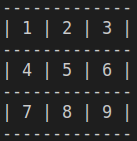

# TIC TAC TOE

In this project we build a Tic Tac Toe game app with Ruby. The game is played in the Terminal.

## Setup

- Make sure you have Ruby 2.6 or +
- Clone or download this repo
- Locate the repo in your terminal
- Run bin/main.rb
- Then, enjoy the game

## Game Description

This Tic-tac-toe game is played by two people.The playground is a board 
consisting of a 3x3 grid with numbered cells

The players take turns to enter a number corresponding to the cell they want
to mark. The goal is to mark three aligned cells with one's symbol. The alignment
can be horizontal, vertical, or diagonal. The first player to achieve this goal is the 
winner. When none of the players is able to align his three marks. The game ends in a draw 

## Instructions

- Upon starting, read a short description of the game. Press 'Enter' to continue
- Next, Enter the players'names.
- Then players are given turns to enter a number corresponding to the cell they want to mark
- The above step is repeated until one player wins or the game ends in a draw
- Press 'Enter' to exit once the game result is displayed

## Technologies

- Ruby (OOP language)

## Author
​
#### 👤 **Hubert MUGABO**
​
- Github: [@mugberto](https://github.com/mugberto)
- Twitter: [@mugberto](https://twitter.com/mugberto)
- Linkedin: [mugberto](https://www.linkedin.com/in/hubert-mugabo-23144b6a/)

 ​
## Contributing

Contributions, issues and feature requests are welcome!
​
Feel free to check the [issues page](https://github.com/mugberto/tic-tac-toe/issues).
​

## Show your support

Please, give a ⭐️ if you like this project!
​
  ​
## License
​
This project is [MIT](lic.url) licensed.